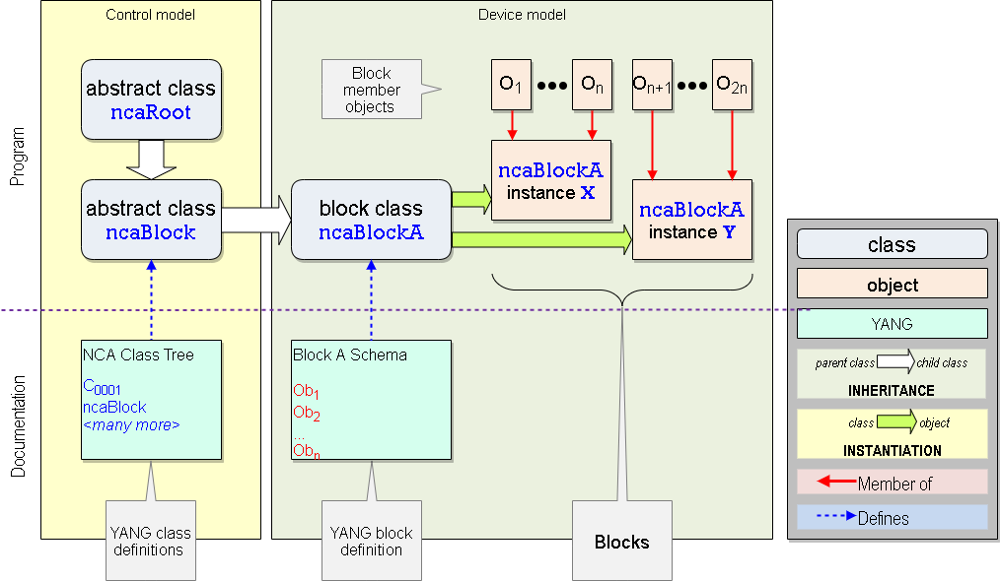
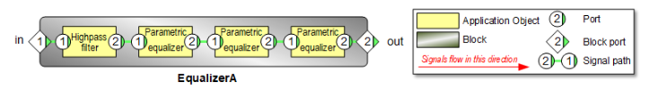
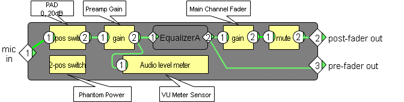
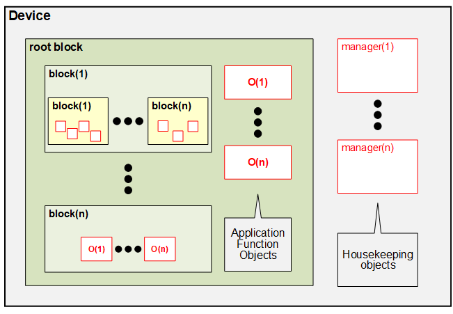
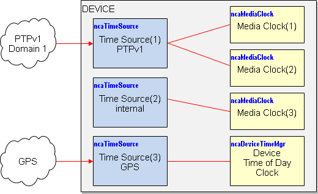
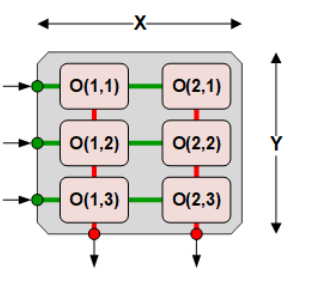
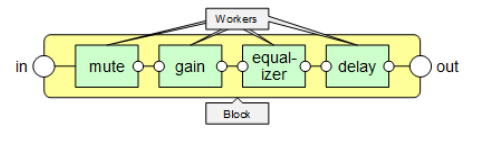
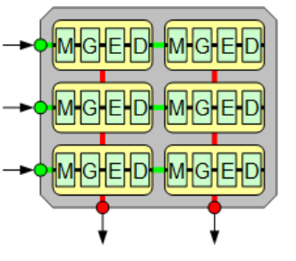
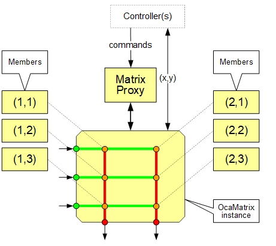
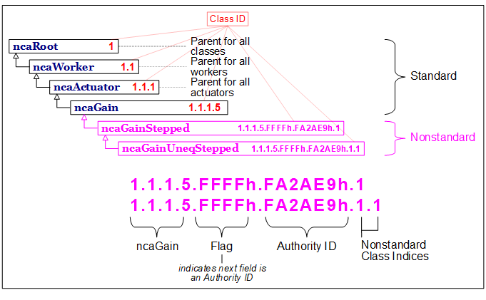

# AMWA NMOS Control Architecture [Work In Progress]

{:.no_toc}

- A markdown unordered list which will be replaced with the ToC, excluding the "Contents header" from above
{:toc}

_(c) AMWA 2021, CC Attribution-NoDerivatives 4.0 International (CC BY-ND 4.0)_

# **Part 1: Architectural Framework**

## 1. Scope and purpose

This document introduces NCA, the **NMOS Control Architecture**. NCA is an architecture for modeling media devices, and controlling and monitoring them over IP networks.

In this and other NCA documents, the term &quot;device control&quot; means &quot;device configuration, control and monitoring&quot; unless otherwise specified. Note that the use of the term &quot;device&quot; in this document does not have exactly the same meaning as it does in earlier NMOS IS-xx specifications. In this document we use the terms &quot;NCA device&quot; and &quot;NMOS device&quot; to make the distinction clear.

NCA&#39;s specification is designed to complement and interoperate with the existing family of NMOS specifications, particularly IS-04, IS-05, IS-07, and IS-08.

**NCA&#39;s purpose is device control (and status monitoring) only.** NCA does not define higher-level mechanisms such as compound media formats, production role data, studio asset records, facilities reservations, accounting data, performance rights data, and so on and on. Such mechanisms might build (in part) upon NCA device control, but their specification is out of NCA&#39;s scope.

**NCA takes as a requirement that media control networks might not be connected to the Internet.** The general operation of NCA does not depend on connections to external data or code resources. Manufacturers may choose to supply controllers and/or devices that depend on wide-area connections to libraries, cloud services, and so on, but such choices will be application decisions not mandated by NCA.

**NCA can apply equally to physical or virtual NCA devices.** In NCA documentation, the term NCA device refers to both unless otherwise stated.

**NCA is not a device or controller implementation specification.** NCA&#39;s features and structures serve to define NCA device Application Programming Interfaces (APIs) that can be used for device control, but the internal programming structures behind those APIs are strictly out of NCA&#39;s scope.

**NCA is not a user interface specification.** The NCA control model defines numerous elements with application functions (switches, indicators, gain controls, etcetera), but these elements are embodied only as abstractions in a NCA device control model. How, whether, or when they are represented in a user control interface is out of NCA&#39;s scope.

## 2. NCA Documentation Structure

Documentation of the NCA is organized across multiple parts:

1. An **architectural framework** that describes NCA&#39;s various models, mechanisms, and rules.
2. A **control repertoire specification** that defines NCA&#39;s specific underlying elements for controlling and monitoring the various components of media devices.
3. One or more **protocol specifications** that define protocols for accessing NCA&#39;s control features over the network.

In addition to the above, NCA anticipates that future phases of work will develop processes for the documentation and curation of a growing set of common models and mechanisms for typical devices and device components found in practice. By leveraging these common models and mechanisms, interoperability between control systems and devices can be improved, and custom engineering avoided in many cases..

### 2.1. Scope of this document

This document describes the NCA architectural framework - item (1) in the preceding section. The subsequent documents will be developed in later phases of the NCA workstream.

## 3. References

**[AS-10]** AMWA AS-10, _MXF for Production_

**[BCP-003-01]** AMWA BCP-003-01, _Securing Communications in NMOS Systems_

**[BCP-003-02]** AMWA BCP-003-02, _Authorization in NMOS Systems_

**[BCP-003-03]** AMWA BCP-003-03, _Certificate Provisioning in NMOS Systems_

**[INFO-002]** AMWA INFO-002, _NMOS Security Implementation Guide_

**[IS-04]** AMWA IS-04, _Discovery and Registration_

**[IS-05]** AMWA IS-05, _Device Connection Management_

**[IS-07]** AMWA IS-07, _Event &amp; Tally_

**[IS-08]** AMWA IS-08, _NMOS Audio Channel Mapping_

**[IS-10]** AMWA IS-10, Authorization

**[NMOS-G]** AMWA _NMOS Glossary:_ [https://specs.amwa.tv/nmos/branches/main/docs/4.0.\_Glossary.html](https://specs.amwa.tv/nmos/branches/main/docs/4.0._Glossary.html)

**[NMOS-OV]** AMWA _NMOS Technical Overview_:
[https://specs.amwa.tv/nmos/branches/main/docs/2.0.\_Technical\_Overview.html](https://specs.amwa.tv/nmos/branches/main/docs/2.0._Technical_Overview.html)

**[JTNM-RA]** Joint Taskforce on Network Media _Reference Architecture v1.0_

IETF RFC documents are referenced by constructs of the form **[RFC n]** where n is the RFC number.

## 4. Definitions

Definitions and abbreviations for this draft

**Control** The capability to affect and/or monitor a product&#39;s function. In this document, _control_ usually implies _network control_, defined next.

**Network control** The capability to control a product remotely, via a network.

**NMOS-DM** NMOS Device Modeling project

**NCA** NMOS control architecture

**Device** See [**The term**](#_hrv9by2tmlrl)[**Device**](#_hrv9by2tmlrl) **,** below.

**ncaPort** An abstract feature of an object that represents the terminus of an internal signal path.

**Controller** See [**The term**](#_of380zomgarz)[**Controller**](#_of380zomgarz), below.

**Control API** Methods, data, and rules for controlling something (a device, or a component of a device

**Control class** Pattern for constructing control objects

**Control object** Realized instance of a control class

**Control class** or just **subclass**: a class created by inheritance from another (&quot;parent&quot; ) class. Synonym of &quot;child class&quot;.

**Control protocol** Definitions of message formats, data flows, data serializations, and exchange rules for accessing control APIs

**Control aggregation** Mechanism by which changing one parameter changes a related set of parameters in a defined way.

**Control group** The set of related parameters that is the subject of a control aggregation instance.

**Framework mechanism** Architectural mechanism essential to NCA operation in any type of device. Conformant Devices must implement all of the Framework Mechanisms.

F **eature-set mechanism** Optional mechanisms that may be configured into schemas as needed.

**List** Written **list\&lt;V\&gt;** **:** an ordered set of values of datatype **V** that is accessed via an index. **V** may be a simple datatype or an object.

**Map** Written **map\&lt;K,V\&gt;** **:** an unordered set of values of datatype **V** that is accessed via a unique key of datatype **K**. **K** may be any simple datatype; **V** may be a simple datatype or an object.

**Object collection** Set of references to objects. An action which deletes or modifies a collection does not delete the objects it references. A Collection is a property of an object.

**Object container** Set of objects. An action which deletes a container also deletes the objects it contains. Note that objects are singly-contained (an object is only contained by one other object).

**Schema** A formal description of the contents of a block.

**Schema composition** The process of assembling a schema that includes other schema.

**Block** or **block object.** An instance of a block class.

**Block class** Subclass of **ncaBlock**.

**Block member** An object contained by a block.

**Nested block** A block contained by another given block, as in &quot;block A is nested inside block B&quot;.

**Root block** The single fundamental block in a device that contains all other control objects and blocks.

**Owning block**or**owner** The block that contains a given object.

**Touchpoint** Linkage item which indicates the association between an NCA item and an identified resource in another control environment (e.g. NMOS IS-xx).

### 4.1. The term _Device_

[NMOS-G] and [JTNM-RA] define _Device_ as follows:

**Device** _A Device is a block of functionality within a networked media infrastructure. Examples of devices could include: camera, microphone, SDI to IP adapter, chroma keyer, audio mixer._

...

As NCA is a part of the NMOS family of specification, use of this term is compatible with prior use within NMOS. However, NCA Devices include additional processing and logic functions not described in existing NMOS specifications, which are focused on senders and receivers [IS-05], event notification emitters and subscribers [IS-07], and routing matrices [IS-08].

This document will use the capitalized term **Device**to denote a device in the NCA sense. The uncapitalized version will be used in nonspecific English uses of the term, e.g. &quot;device control&quot;. Where a clear distinction must be made between earlier NMOS and NCA devices, the term will be qualified, as in &quot;NCA Device&quot;, &quot;NMOS Device&quot;, and so on.

### 4.2. The term _Controller_

In this document, the capitalized term **Controller**means a programmatic entity for controlling Devices using NCA-specified means. The uncapitalized version will be used for the nonspecific English use of the term, e.g. &quot;controllers for non-NCA environments&quot;. Where a clear distinction must be made between NCA and non-NCA controllers, the term will be qualified, as in &quot;non-NCA controller&quot;, &quot;NCA Controller&quot;.

## 5. Components of the architecture

### 5.1. Models

NCA is based on two interrelated models:

- The **control model**, which describes the mechanisms of NCA control, and the repertoire of elementary NCA control functions used to describe Device control elements. This includes the class definitions and methods.
- The **Device model**, which describes how control and management model elements are instantiated and configured to create the control API that a Device exposes to the network.

The Device model is concerned _only_ with Device control and management APIs, and not internal implementation structures of NCA-compliant products.

NCA defines both the Device model and the control model in object-oriented terms. Thus:

- The control model defines a set of **control classes** (or just **classes**)that can be used to construct **control objects** (or just **objects**);
- The Device model describes how those classes are instantiated and configured to form Devices.

In this document, control class names will be prefixed by &quot; **nca**&quot;, e.g. &quot; **ncaSwitch**&quot; might be the name of a control class that exports an API for controlling a switching function.

### 5.2. Classes, objects, and APIs

In NCA, each object has its own control API. The signature of each object&#39;s API is completely defined by the class of which it is an instance. The complete API of a Device is exactly equal to the union of the APIs of all the objects it contains.

Thus, if a Controller knows all the objects in a Device, and if it knows the definitions of the classes of which those objects are instances, then it knows the Device&#39;s complete API.

In many cases, Controllers will have been custom-built for Devices they control, and will therefore have the required object and class information _a priori._ However, NCA provides rich mechanisms for controllers to acquire such information from public registries and from the devices themselves.

### 5.3. Protocols

A controller needs a control protocol to access control APIs. The definition of control protocols is outside the scope of this architecture specification, but protocol definitions are clearly required for the models to be useful.

NCA&#39;s control model defines APIs abstractly, but leaves their physical specification to subsequent protocol design phases. Future protocols may implement control APIs in various ways, but all API implementations will share the parameters and semantics defined by the models.

A future phase of the NCA project will define one or more control protocols.

## 6. Model specification language

Normative specifications of NCA control and Device models is expressed in the YANG 1.1 modeling language defined by[RFC 7950], with the YANG complex-type extensions defined by [RFC 6095]. As well, NCA adds a set of custom YANG extensions that are defined in the control model base text.

## 7. Control model

### 7.1. Classes

An NCA class is a control abstraction with three elements:

- **Properties**. These are control and status parameters. Each has a datatype and a value. Datatypes may be simple values - boolean, number (various types), text string, bitstring, etcetera, or complex structures defined in class definitions. A datatype may be an individual item (scalar), a List of items, or a Map of items.
- **Methods** **.** Methods represent actions a Controller may take on the object. The most common kinds of methods are get(...) and set(...) functions that retrieve and store the values of properties. However, other kinds of methods (e.g. start(...), stop(...)) are defined for some classes.
- **Events**. Events are defined conditions that arise inside objects; Controllers may subscribe to events from an object. For example, all objects include the **PropertyChanged(...)** event, which is raised (i.e. occurs) when the value of a property of the object has changed.

The subscription mechanism is described further in **Events and Subscriptions** below.

NCA classes are interface-defining classes that imply nothing about the programming classes inside actual products. Some Device developers may elect to use object-oriented programming environments with software class structures that mirror the NCA class tree, while others may take entirely different approaches. Such choices are outside NCA&#39;s scope.

Each property, method, and event of a class has a unique identifier. These identifiers (_element identifiers_) are described in the **Identification** section later in this document.

### 7.2. Class inheritance

The NCA control model defines a class inheritance mechanism, in which the various classes&#39; definitions are derived from the definitions of other, more elementary classes, with everything ultimately leading up (if you think of ancestry diagrams) or down (if you think of trees) to a single fundamental base or root named **ncaRoot**. Thus, a control class is the outcome of a **class inheritance hierarchy**.

When a class inherits from another class, _all_ of its properties, methods, and events are inherited. A notable example of this mechanism is the **PropertyChanged(...)** event. **PropertyChanged** is defined in **ncaRoot**. All classes in the model inherit directly or indirectly from **ncaRoot** ; therefore, they all have **PropertyChanged(...)** events. Consequently, a controller can subscribe to property-value changes for any object in the NCA device.

_This document will visualize the class inheritance hierarchy as a tree in inverted form, with ncaRoot at the top, and successive refinements of ncaRoot extending downward. Our tree will be a trailing vine._

#### 7.2.1. Class inheritance rules

Over time, the NCA-defined tree of classes will grow. Additionally, product developers will likely extend the public-defined tree with proprietary classes to cover product-specific functions. To cover both of these cases, NCA has expansion rules that ensure the tree expands in a compatible manner, in which new classes, whether arising from NCA growth or proprietary extension, coexist harmoniously with legacy ones.

These rules are:

1. New classes must be defined by inheritance from existing ones.
2. A new (&quot;child&quot;) class must implement all the properties, methods, and events of the class (&quot;parent&quot;) from which it inherits.
3. A child class may expand its parent&#39;s definition by:
  3.1. Defining additional properties, methods, and/or events; and/or
  3.2. Augmenting the definitions of existing properties, methods, and/or events, In this case, the enhanced definitions must support all functions defined by the parent class.
4. A child class&#39;s inherited elements must retain the respective element IDs (see [**Identification**](#_rcilelyelwgb), below) from its parent class.

### 7.3. Class hierarchy

For NCA to meet its interoperability objectives, a repertoire of common class definitions must exist. These classes are defined in the NCA control model, via an inheritance hierarchy of control classes that descends from **ncaRoot**.

NCA Control classes are specified in several categories and subcategories. Each category or subcategory has its own base class that inherits directly from **ncaRoot**. All the classes in a category inherit from that category&#39;s base class. Thus, each category is a subtree of the overall hierarchy.

[Figure 1](#fig_ControlModel) illustrates the NCA class tree, and shows the categories.


**[Figure 1](#figur_ControlModel). NCA Control Model**

#### 7.3.1. Class categories

The categories shown in [Figure 1](#fig_ControlModel) are as follows:

- The **Blocks** subtree contains the definition of **ncaBlock** - see [**Blocks**](#_vdybizkdqrg2), below.
- The **Workers** subtree contains definitions of classes that have something to do with media signal processing. Here will be found all the familiar audio and video control and monitoring functions.

**Workers** has two subtrees - **Actuators** , which affect signals in various ways, and **Sensors** , which monitor signals.

- The **Matrices** subtree contains the definition of **ncaMatrix** , an optional but useful class in which media signals are constructed by choosing (like in a crosspoint) or combining (like in a mixer) from a set of input signals.
- The **Agents** subtree contains definitions of classes that affect control flow, or that handle specific non-media functions such as power supplies, geolocation sensors, and more.
- Additional broad categories may emerge in future work.

- The **Managers** subtree contains definitions of classes that perform Device housekeeping functions. Each manager class may be instantiated at most once per NCA device. A few of them must be instantiated for NCA conformance - see [**Base Device Schema**](#_dka4rc8wdnj8)below.

Two particularly notable Managers are:

1. **ncaDeviceManager**. Contains generic product information (model &amp; serial numbers, for example) and holds overall Device status indicators.
2. **ncaSubscriptionManager**. Manages Controller subscriptions to events.

- The **Workflow Data Classes** subtree contains definitions of classes that contain production workflow information associated with the contents and context of media signals. NCA does not define the format of such data, but provides container services to store and forward it.

### 7.4. Datatype definitions

To support the class definitions, the control model also contains an extensive set of **datatype definitions**. These definitions specify the scalar and structural datatypes used to define class properties and method parameters.

## 8. Device model

### 8.1. Blocks

The control model defines an abstract class named **ncaBlock** that is a container for objects. Subclasses of **ncaBlock** are called **block classes**. Each block class defines a specific configuration of objects.

In Devices, block classes are instantiated to make objects known as **blocks.** A block class may be instantiated as many times as required to define the required control API. For example, an eight-channel audio mixer might define a block class named **myMixChannel** and instantiate it eight times, to create eight blocks which define the eight required channel-control APIs.

#### 8.1.1. Nested blocks

A block may contain other blocks. The contained blocks are said to be **nested**inside the containing block. For example, the **myMixChannel** class might specify an instance of a block named **EqA** that defines an equalizer section. **EqA** is &quot;nested&quot; inside **myMixChannel**.

#### 8.1.2. Block namespaces

Every NCA object has a name that is unique _within its containing block_ (see [**Identification**](#_rcilelyelwgb), below), and every block constitutes a namespace for the objects it contains.

If a block class is instantiated multiple times in a device (such as in the eight-channel mixer example above), the names of its contained objects (e.g. **Gain,**** Mute, ****Pad,**...) will not conflict, because each of the eight block objects is a separate namespace - at a parent level of the hierarchy, the channels must have unique names.

### 8.2. Schemas and Schema IDs

In NCA, a **schema** is a YANG code block (text file) that defines a block class. Schemas are built according to the following rules:

- A schema defines a block class as an RFC 6095 YANG complex type.
- The block class must be defined as an extension of **ncaBlock** or an extension of a subclass of **ncaBlock**.
- The schema must import the schemas of all nested blocks - see [**Schema composition**](#_fbm27574bqse), below.
- The schema must contain instance declarations of all the block&#39;s objects and all its nested blocks, as needed to define the block&#39;s control API.
- The schema may specify the block class&#39;s signal flow, if signal paths are being used - see [**Signal paths**](#_y6cxs2q48h9), below.
- Every schema is identified by a **schema ID.**
- For schemas which are intended to be used across industry or across products, this **schema ID** value will be constructed in a way that is globally unique - a Global Schema ID (GSID) value - see [**Identification**](#_rcilelyelwgb), below.

A schema is not a block, it is only the description of a block. Schemas are the standardized way of documenting the contents of block classes within NCA.

NCA also allows blocks whose contents are dynamic at runtime, see [**Device configurability**](#_fxswj84o5yz), below.

A block class may be **instantiated** any number of times within a device.

Schema concepts are illustrated in [Figure 2](#fig_SchemaConcepts)below.



**[Figure 2](#figur_SchemaConcepts). The ncaBlock abstract class, a block class, two blocks, and related YANG documents**

[Figure 2](#fig_SchemaConcepts) shows both the control model and the Device model.

1. On the left is the control model with its YANG definition files. In this case, only two control model classes are shown: **ncaRoot** , which is the parent of everything, and **ncaBlock** , which is the abstract base class upon which all block classes are built.
2. On the right is an example Device model showing a block class named **ncaBlockA** and its instances. In this example, **ncaBlockA** is instantiated twice, once as block **X** and once as block **Y****.**

[Figure 2](#fig_SchemaConcepts) illustrates that NCA uses YANG for two distinct purposes:

1. Defining the control model&#39;s class tree.
2. Defining schemas.

These purposes are separate, and involve two separate sets of files. It is expected that in the long run, the control model files (case 1) will become relatively static, and generally subject to common specification by a governing authority; on the other hand, the repertoire of schema files (case 2) will continue to grow and evolve for an indefinite period, many of them being product-specific or vendor-specific.

_Note: YANG documentation uses the word &quot;schema&quot; more generally than NCA does. In YANG terminology, a &quot;schema&quot; is_ **any** _YANG definition file; in NCA language, a &quot;schema&quot; is a YANG definition of a specific block class&#39;s contents._

#### 8.2.1. Schema composition

When a block contains nested blocks, its schema imports the nested blocks&#39; schemas and defines instances of them.

The design process of creating a schema by including one or more other schemas is called **schema composition**, the resulting schema is called a **composite schema** **, a** nd the corresponding block is called a **composite block.** By retrieving the value of the **schemaID** property for each of a composite block&#39;s nested blocks - recursing to inner nesting levels as necessary - a Controller can acquire a complete definition of the block&#39;s capabilities.

In addition to the schemaID, block classes include methods for retrieving the inventory of contained objects, as further detailed in section (insert reference link to 11.6 here)

Creating a composite schema has three main steps:

1. Importing the nested schemas using YANG **import** statements.
2. Defining instances of the nested schemas in the composite schema using YANG **ct:instance** statements.
3. Adding whatever other objects are needed in the composite schema using standard YANG methods.

#### 8.2.2. Device schemas

A **Device schema** is the schema that describes the complete control API of a (real or virtual) Device. It includes:

- The list of the Device&#39;s housekeeping objects
- The root block schema (which includes the schemas of blocks contained within the root block).

##### 8.2.2.1. Base Device Schema

NCA defines the **Base Device Schema** **,** which is a Device schema that all Device schemas must implement to be NCA-compliant. It defines a minimal list of housekeeping objects and an empty root block.

#### 8.2.3. Schema reuse

A prime goal of NCA is to support a growing ecosystem of schemas that can be reused by Device developers. NCA (as an architecture) does not define this ecosystem or its management, but it does provide a few features to support it.

It is expected that reusable schemas will be maintained in public, corporate, and personal libraries, from which they can be retrieved for various purposes. Such purposes will include:

- Software development of Controllers and Devices;
- In-situ diagnosis of network media system problems;
- Setup of generic, self-configuring Controllers; and
- Training and tutorial processes.

It is further expected that these reusable schemas will mainly be component schemas. AMWA&#39;s process for developing, publishing, maintaining, and curating these schemas is beyond the scope of this document.

Since schemas are YANG documents, the envisioned reusable schema ecosystem will be fundamentally concerned with the storage, retrieval, and maintenance of YANG texts.

#### 8.2.4. Schema identification

A key NCA feature to support schema libraries is the Global Schema ID, or GSID. In schema libraries, a unique GSID value will be assigned to each schema intended for reuse. GSIDs will be the principal query key for people or systems seeking to retrieve schema definitions from public or corporate libraries, and will be the primary way Controllers retrieve definitions of schemas that Devices implement.

The syntax of the GSID is defined in [**Identification**](#aute3teyjoks) below.

#### 8.2.5. Schemas and APIs

A block&#39;s complete API is equal to the union of the APIs of its members, including members of other nested blocks, if any. Therefore, the block&#39;s schema constitutes a definition of the block&#39;s entire API.

The API the schema defines is a protocol-independent construct, expressed in terms of objects and their properties, methods, and events. Controllers will access it using whatever NCA protocol(s) the Device implements.

### 8.3. Block enumeration mechanisms

The base ncaBlock class defines enumeration functions that allow Controllers to interrogate blocks and their sub-blocks directly, to reveal their detailed contents.

The block enumeration functions are regular methods of **ncaBlock-** derivedclasses, accessed in the usual manner through protocol exchanges between Controller and Device. In the case of dynamically-defined devices in which the contents of blocks may vary at runtime, the property-change event can be used to notify controllers about changes to the ncaBlock inventory.

### 8.4. Signal paths

A block may expose a set of **signal paths**. A signal path is the NCA abstraction that represents a signal flow from one endpoint to another inside a block.

Signal path endpoints are called **NCA ports** or, in context, just **ports**. One or more ports can belong to any object with media signal functionality - processing, monitoring, storing, generating, sending, receiving, etcetera.

**NcaBlocks** can have ports. A port belonging to a block is called a **block port.** A block port is special in that it can connect to both ports of objects outside the block and ports of objects inside the block. Thus, signals enter and leave blocks via block ports.

[Figure 3](#fig_EQBlock) shows the ports and signal paths of a simple multistage audio equalizer block.



**[Figure 3](#figur_EQBlock). A simple block, its block ports, its members and their ports, and its signal paths**

Signal paths cannot cross block boundaries - no signal path may extend from a port inside a given block to a port outside that same block. However, a signal path may extend from a port inside a given block to a block port of that same block, and from there to other block ports, etcetera.

Ports that send signals are called **output ports**; ports that receive signals are called **input ports**. An output port may connect to multiple downstream input ports, but an input port may connect to at most one upstream output port.

The complete set of signal paths for a block is called the block&#39;s **signal flow**.

Use of the signal path mechanism is preferred, but not strictly required.

Depending on implementation, a block&#39;s signal flow may be read-write or read-only. In a fully-dynamic block, Controllers can retrieve and modify the signal flow. In a static block, Controllers can retrieve the signal flow but not modify it. The **ncaBlock** class has methods for retrieving and, if supported, modifying block signal paths.

### 8.5. Complete block example

A complete block example is shown in [Figure 4](#fig_MicPreBlock). This example illustrates both block composition and signal flow. The Device shown is a simplified microphone preamplifier. It includes a nested instance of the equalizer block shown in [Figure 3](#fig_EQBlock).



**[Figure 4](#figur_MicPreBlock). Example microphone preamplifier**

### 8.6. Device structure

As illustrated in [Figure 5](#fig_Device) below, the Device model envisions a Device as a **root block** accompanied by a few housekeeping objects. The root block is an instance of the **ncaBlock** subclass **ncaRootBlock****.** The root block contains all the objects that control the device&#39;s application functions. In simple devices, these objects might be contained directly in the root block; in more complex devices, they will be contained in a hierarchy of blocks nested inside the root block.

Every Device contains exactly one instance of **ncaRootBlock**.

An object contained in a block is called a **member** or **member object** of that block.

A Device may have certain application functions the designers wish not to be network-controllable. Such functions will not be represented in the root block or its nested blocks, and will consequently not be in the device&#39;s control API.

The housekeeping objects are called **managers** and are discussed in [**Managers**](#_96ljnmcmwsf6), below.



**[Figure 5](#figur_Device). NCA device**

### 8.7. Device configurability

&quot;Device configurability&quot; means the degree to which an NCA Device&#39;s object population and internal signal paths can be defined at run time, as opposed to time of manufacture.

As shown in [Table 1](#tab_Configurability), NCA identifies four levels of Device configurability. The levels are further classified into **static** and **dynamic** categories. A Controller of a static Device can assume its configuration is fixed. A Controller of a dynamic Device can make no such assumption. In environments with multiple Controllers, each Controller will need to monitor the configurations of dynamic Devices to track changes.

| **Configur-**** ability **|** Category **|** Description** |
| --- | --- | --- |
| Fixed | static | The Device has a permanently assigned object repertoire and signal-flow topology, defined at time of firmware programming. |
| Pluggable | static | The object repertoire and signal flow of the Device may be changed while the Device is offline, by plugging and unplugging of hardware modules, adjustment of physical controls, reloading or readjustment of software, or other manual means. |
| Partially configurable | dynamic | Controllers may change the signal-flow topology of the Device while online. |
| Fully configurable | dynamic | A superset of &#39;partially-configurable&#39;, with the addition that Controllers may create and delete objects inside the Device while online. |

**[Table 1](#table_Configurability). Device configurability**

## 9. Identification

NCA defines the following framework identifiers (a &quot;framework&quot; identifier is an identifier that is used by the basic NCA framework, irrespective of application). [Table 2](#tab_Identifiers) lists the identifiers NCA uses.

| **Identifier**
**Datatype** | **Scope** | **Lifespan** | **Format** | **Description** |
| --- | --- | --- | --- | --- |
| **Class ID**
**ncaClassID** | NCA control model | Permanent | See [Appendix A](#_uhf93cuwhkf6) | Uniquely identifies a class and its revision level. |
| **Object ID** **ncaOID** | Device | See 10.1 below | Uint32 | Compact read-only handle that uniquely identifies an object within its device. Every class inherits the **Object ID** property, and this property has a valid value for every object. |
| **Name**
**ncaOName** | Block | Permanent | String | Static, read-only text property that names an object within the block to which it belongs. Unique within the block. Every class inherits the **Name** property, and this property has a valid value for every object. **Name** is analogous to the control labels silk-screened onto traditional physical control panels. &quot;Input Gain&quot;, &quot;Output Select&quot;, etcetera., or to the filename in a hierarchical file system. |
| _continued ..._ |
| **Identifier**
**Datatype** | **Scope** | **Lifespan** | **Format** | **Description** |
| **Object Path**or just_
 **Path** **ncaOPath** | Device | Permanent | Array of strings | Unique identifier of an object within a device, consisting of the ordered concatenation of the **Name** values of all the object&#39;s containing blocks, starting from the **Root Block** , ending with the object&#39;s own **Name** value. Note that while the object ID may change over time due to reconfiguration, the object path is a persistent identifier of a specific function or property within a device. |
| **User Label** **ncaString** | n/a | Can change at any time | String | Read/write string that users may set to identify an object&#39;s operational purpose in a particular application context. Analogous to the texts written on mixing console scribble strips, labels, and bits of paper tape affixed to equipment in use. &quot;Elvis&#39;s Vocal Mic&quot;, &quot;First violins #3&quot;, etcetera.This label need not be unique in any scope. |
| **Product GUID** **ncaGUID** | Universe | Permanent | GUID | Read-only GUID that uniquely identifies the particular product that constitutes the Device. Property of the class **NCA deviceManager**. |
| **Schema ID** **ncaGSID** | Global or local, as declared | Permanent | TBD | identifier of a schema - see [**Schema Reuse**](#_kw18irgerdhu)above. The schema ID definition will contain both a &quot;namespace&quot; part and an identifier, and the identifier part will be unique within the namespace. A special namespace identifier exists to define &quot;device-local&quot; schemas if needed. |
| **Property ID
 Method ID
 Event ID **_** ncaPropertyID **_** ncaMethodID **_** ncaEventID**_ | Object | Permanent | See [Appendix B](#_ulwzlogu7a95) | Static identifiers that identify the properties, methods, and events of control classes. Values are defined by the class specification in the control model, and do not change over time. Unique within each class. |
| **Connection Management Identifiers** | future | TBD | TBD | stream identifiers, connection endpoint identifiers, media transport session identifiers, and others. Compatible with NMOS IS-04 and -05 and the JT-NM Reference Architecture. This is a future NCA topic, not defined in NCA 1.0. |

**[Table 2](#table_Identifiers). NCA Identifiers**

### 9.1. Object ID management

Object IDs can change from time to time within a device, based on dynamic configuration and other events. Each block object maintains an object ID revision timestamp that indicates the last time the object IDs of its members block have changed.

### 9.2. 1NCA-NMOS identity mapping

NCA&#39;s **Touchpoint** feature allows applications to attach a list of _touchpoints_ to any NCA object. A touchpoint is a defined relation between an entity in NCA and an entity in a different namespace.

This document defines the mapping to NMOS IS-xx resources; other mappings may be defined in the future, through specifications or by implementers as necessary.

The touchpoints feature is implemented by the **Touchpoints** property of **ncaRoot**. **Touchpoints** is a list of zero or more **touchpoint descriptors**. For a given nca object, each touchpoint descriptor identifies a foreign namespace and a list of one or more identifiers of entities within the foreign namespace.

Because **Touchpoints** is defined in **ncaRoot** , it is inherited by every NCA object and may be used as required.

#### 9.2.1. NMOS Namespaces

Namespaces for NMOS are as follows:

- IS-04: **x-nmos** (includes the identities which link to IS-05 and IS-07)
- IS-08: **x-nmos/channelmapping** (special touchpoints for IS-08 Input and Output resources)

##### 9.2.1.1. Touchpoint Resources for NMOS

The resources are provided as an array of objects. The NMOS touchpoint resources need to include:

- Resource type type of resource linked
- ID identity of the resource in the given namespace

For the **x-nmos** namespace, **ncaTouchpointResourceNmos** is defined and supports the following resource types:

- Node
- Device
- Source
- Flow
- Sender
- Receiver

For the **x-nmos/channelmapping** namespace, **ncaTouchpointNmos\_is\_08** is defined, and supports the following resource types, and the touchpoint resource id should be that of the underlying NMOS device.

- Inputs
- Outputs

YANG models for the touchpoints are defined as part of the overall ncaRoot definition in the control model.

### 9.3. NCA discoverability in IS-04

Compliant NCA protocols will need to be advertised through existing IS-04 practices inside the controls array of an NMOS Device. An example is illustrated in [Code Block 1](#cod_NMOSControls) below. The specific type tag for each protocol will be defined by the protocol defining document.

```json
{ ...
    "senders": [
        "a65c15a4-a52e-4960-8cd2-e05c31196e5f",
        "68f519a3-5523-4b2c-b72d-ec23cc80207d"
    ],
    "receivers": [
        "8a7bb1c1-4a82-4fd9-a4fb-96f68f560831",
        "ab450c07-ce54-44da-9ea9-c3e62e7b06d0"
    ],
    "controls": [
        {
            "type": "urn:x-nmos:control:nca/v1.0",
            "href": "transport scheme"
        }
    ],
    "tags": {},
    "type": "urn:x-nmos:device:generic",
    "label": "NMOS Device",
    "version": "1529676926:000000000",
    "node_id": "d1713110-7343-4d9e-b3f4-456c8f6ce765",
    "id": "58f6b536-ca4c-43fd-880a-9df2501fc125",
    "description": "NMOS Device"
...
}

**[Code Block 1.](#codeb_NMOSControls) NMOS Controls array with NCA entry**

## 10. Framework Mechanisms

By &quot;framework mechanisms&quot;, we mean architectural mechanisms that are essential to the operation of NCA in all devices. Framework mechanisms are distinguished from **optional mechanisms** that may be configured into schemas as needed.

### 10.1. Control Traffic

NCA traffic between Controllers and Devices consists of three kinds of control messages:

- A **Command** is a call to a method of an object. Commands travel from a requesting Controller to a controlled object.
- A **Response** is a controlled object&#39;s returned result from a Command. The Response travels from the controlled object to the requesting Controller.
- A **Notification** is an object&#39;s announcement of an event occurrence. Notifications travel from the controlled object to all of the Controllers that have subscribed to the given event.

NCA defines a Controller as a software function, not as a physical entity, and a Device as a real or virtual construct. The command travel paths listed above refer to communication of information between software entities, not necessarily physical pieces of equipment.

The actual means of control message transport and the formats of the messages are determined by the protocol being used. NCA protocols are out of scope of this document.

### 10.2. Control sessions

NCA control is session-oriented, which implies the following:

1. Requests and responses occur in correlated (but not blocking) pairs.
2. Controlled Devices (and their inventory of objects) have persistent application relationships with Controllers.
3. Prompt discovery of Device failure or communication failure is a required feature of the protocol.
4. Devices shall report changing parameters to subscribing Controllers. Subscriptions are valid through the conclusion of the control session unless explicitly un-subscribed.
5. When a communication failure occurs, the control session behaviour shall be well-defined. Whether the session survives or gracefully dies is a property of the protocol in use.

### 10.3. Events, Notifications, and Subscriptions

NCA supports the use of multiple simultaneous Controllers. Those Controllers might be coordinated - in the case of a Controller redundancy architecture, for example - or they might be uncoordinated - for example, several Controllers from different makers, controlling different but somewhat overlapping aspects of system functionality.

Multicontroller applications are more common than it might seem, because a physical Device&#39;s front panel controls constitute a Controller. Thus, **every case in which NCA controls Devices that have their own physical controls is a multicontroller application.**

In all multiple control point situations, timely tracking of parameter and state updates is required for error-free Device control. NCA&#39;s core update-tracking mechanism is the **event** **.** An event is anything that happens inside a Device that a Controller may need to know about.

One way Controllers can discover Device changes is to poll them. A goal of NCA is to render polling completely unnecessary in all cases. To this end, NCA events generate **notifications**_._ A notification is a spontaneous message from a Device to one or more Controllers that announces the occurrence of an event and gives its particulars.

Not all Controllers need to know about all events. When a Controller wants to be informed of the occurrence of a certain event in a certain object, it registers a **subscription**with a housekeeping object named **ncaSubscriptionManager.** A subscription causes a **notification message** to be delivered to the subscribing Controller whenever the designated event is raised in the designated object.

Once registered, a subscription remains in effect for the life of the control session, unless the Controller cancels it.

#### 10.3.1. Notification messages

A notification message is essentially a callback command whose parameters depend on the type of event. However, unlike actual commands, a notification does not require a response.

The parameters of notifications depend on the type of event. In general, event parameters are designed to give full detail about the event, so that Controllers receiving events can act on them immediately, without having to query the Device further.

#### 10.3.2. Notification delivery

The precise method by which notifications are delivered back to Controllers is a protocol issue, and out of scope of this document. However, for efficiency, the control model does identify two abstract ways of notification delivery. These are identified as _reliable_ and _fast.**Reliable** delivery uses the same delivery method as Commands and Responses; **Fast** delivery uses lower-overhead, lower-reliability methods.

**Fast** delivery may support multicasting; if so, Devices are allowed to multicast notifications for events to which there are multiple subscribers.

Controllers specify the type of delivery separately for each subscription. This allows them to elect **Reliable** delivery for critical events such as error alerts, and **Fast** delivery for noncritical events such as signal level sensor updates.

The control model says nothing about how **Reliable** and **Fast** delivery schemes are implemented. Their implementation will vary from protocol to protocol. In some cases, the two may be the same. **Fast** may or may not be able to multicast. The control model only defines the abstraction, not the realization.

#### 10.3.3. The PropertyChanged event

The most common event is the **PropertyChanged** event, which is defined by **ncaRoot** , and so inherited by every object. **PropertyChanged** is the key mechanism for NCA&#39;s support of multiple Controllers without polling. By subscribing to changes in the properties it cares about, a Controller can stay in sync with the device, even when those properties are being changed by other controllers. The specifics of the subscription mechanism and methods for subscribing to subtree events are a subject of future work.

### 10.4. Controller hierarchies

Some NCA-controlled media networks may contain thousands of devices. In such cases, it will not be practical for a single central Controller to maintain a separate control session with each device. To address this problem, indirect control using a hierarchy of Controllers may be implemented, with successive levels aggregating control functionality in ways appropriate to the applications.

### 10.5. Concurrency control

NCA supports applications that use multiple simultaneous Controllers in which a particular object may receive directives from more than one Controller.

In such applications, certain application control events require the exchange of more than one control message. Therefore, the potential for a race condition exists. To prevent race conditions, NCA supports single-threading via a simple object-locking mechanism with the elements listed below.

An NCA lock is a mutual exclusion (&quot;mutex&quot;) mechanism designed to prevent some or all access to the object by anyone other than the lockholder.

The NCA lock mechanism is for transient programmatic use. It is not:

- An authorization/permission mechanism for controlling user access to Devices or their features;
- A reservation mechanism for securing user access to Devices or features at a later time; or
- An operations mechanism for restricting Device access during maintenance, or when problems are occurring, or for other facility management purposes.

The NCA mechanism supports two levels of lock, as follows:

1. **NoReadWrite** locks, which prevent all access to the object by non-lockholders - read requests while in this state will return a &quot;not-ready&quot; type of status.
2. **NoWrite** locks, which prevent non-lockholders from modifying object data, but allow them to retrieve it.

The owner of a lock (lockholder) is the Controller that sets the lock. Locks are expected to be ephemeral.

The lock interface is in the **ncaRoot** class, and therefore is inherited by every other NCA class. However, non-lockable objects may be defined, if desired, as described below.

Locking rules are defined as follows, subject to the data definitions in the YANG control model spec:

1. An object may be implemented as **lockable** or **non-lockable**. A non-lockable object shall return the **NotImplemented** status codes from all locking-related commands.
2. The lockability or an object shall be indicated by the value of its **Lockable** property. **Lockable** is inherited from **ncaRoot**.
3. A lockable object shall be locked by at most one lockholder at a time.
4. A locked object may be locked **NoReadWrite** or locked **NoWrite** , but not both.
5. An object locked **NoReadWrite** may only be read or written by the lockholder.
6. An object locked **NoWrite** may be read by any Controller but only written by the lockholder.
7. A lockholder may upgrade its lock from **NoWrite** to **NoReadWrite** , or downgrade its lock from **NoReadWrite** to **NoWrite, or** remove its lock entirely.
8. No lock survives a Device reset.
9. Controller to Device communication is session-oriented. When a Controller&#39;s session ends for any reason, the Device must automatically remove all locks set by that Controller session.
10. It is possible to lock an entire Device by locking its Device Manager object (see [**Managers**](#_96ljnmcmwsf6), below), provided that none of the device&#39;s other objects are locked.
11. Locked objects may not be deleted.

### 10.6. Capability enumeration

To discover the detailed capabilities of a block, a Controller enumerates its objects and its signal paths.

####


#### 10.6.1. Object enumeration

We refer to an object contained by a block as a _member_ of that block. **ncaBlock** has the following methods for enumerating a block&#39;s members:

**GetMembers(...)** Returns the list of members.

**GetMembersRecursive(...)** Returns the list of members of the block and all contained blocks.

**FindMembersByPath(...)** Finds members of the given block, given a path specification that may include wildcards.

**FindMembersByPathRecursive(...)** Finds members of the given block and all contained blocks, given a path specification that may include wildcards.

**FindMembersByUserLabelRecursive(...)** Finds members of the given block and all contained blocks, given a user label value that may include wildcards.

#### 10.6.2. Signal path enumeration

**ncaBlock** defines two methods Controllers can use to enumerate signal paths:

**GetSignalFlow(...)** Returns the block&#39;s internal signal flow.

**GetSignalFlowsRecursive(...)** Returns the internal signal flows of the given block and all contained blocks.

These functions return simple lists of signal-path descriptors. Each signal-path descriptor specifies the ports at each end of the signal path.

### 10.7. Time and media clocking

NCA allows an arbitrary number of independent media clocks per device. These media clocks can be synchronized to various kinds of internal and external time references. As well, NCA supports a Device time-of-day clock that can also be synchronized to an external time reference. An example is in [Figure 6](#fig_Clocks).



**[Figure 6](#figur_Clocks). Device with multiple media clocks and time sources.**

In the NCA control model, each external or internal time reference is represented by an instance of class **ncaTimeSource** , each internal media clock is represented by an instance of class **ncaMediaClock** , and the Device time of day clock is represented by the singleton housekeeping object **NCA deviceTimeManager.**

### 10.8. Networking

The NCA networking mechanism has two kinds of network interfaces: _control network interfaces_, which are the network interfaces that receive and transmit control protocol traffic, and _media transport network interfaces_, which receive and transmit media streams.

The class structure is as follows:

1. **ncaBaseNetwork** is an abstract base class that defines the common elements of all networks.
2. **ncaControlNetworkInterface** is a child of **ncaBaseNetwork** for control protocol traffic.
3. **ncaMediaTransportNetworkInterface** is a child of **ncaBaseNetwork** for media streaming traffic.

These classes will be defined in detail in future phases of work.

### 10.9. Reliability

NCA enables implementations reliable enough to satisfy:

- Critical live-to-air and studio production requirements
- Legal requirements for broadcast system reliability, including emergency broadcast requirements
- Major live performance and presentation events requirements

NCA&#39;s architecture supports reliable implementations with the following features:

1. **Multiple redundant control networks**
2. **Multiple redundant media transport streams and networks**
3. **Control traffic security**

NCA control traffic security features (see [**Security**](#_kz3cwxzgnrbl), below) reduce the chance of control failure due to malicious activity.

1. **Fully-acknowledged command/response architecture**

All NCA commands are acknowledged. No open-ended mechanisms (e.g. multicasting) are used for critical protocol traffic.

1. **Poll-free design**

All asynchronous device changes can be discovered by event subscription; no Controller polling is required. With correct implementation, no polling-related race conditions are possible.

1. **Device supervision**

See [**Device supervision**](#_yxrzg9u60r3y), below.

1. **Secure Device reset capability**

See [**Device reset**](#_br6dtwcszrnk) **,** below.

NCA protocols (defined in future work) may support additional reliability features - for example, Ethernet-based protocols can support spanning-tree Ethernet and/or can use reliable data transport protocols such as TCP.

#### 10.9.1. Device supervision

Devices are continuously supervised with the aid of **heartbeat messages**. Such messages shall be defined as part of each NCA protocol specification.

Device supervision ensures that a control session (see [**Control sessions**](#_hhdodk2rnrpm), above) is not retained after either of its endpoints disappears, while simultaneously allowing the case that the control session might (protocol specific) be allowed to persist in the case of temporary communication failure.

The exact format of heartbeat messages and the specific rules of the Device supervision mechanism are protocol-specific.

#### 10.9.2. Device reset

The NCA Device reset function allows systems to recover effectively from catastrophic errors. A Device reset has the effect of returning the affected Device to the state it was in immediately following power-up.

Device reset is an optional feature.

A Device reset is invoked when it receives a _Device-reset command_.

- A Device-reset command may use a special protocol data unit with a simple, recognizable format that can be handled by low-level recovery code in devices.
- Every Device reset command should include mechanisms to prevent malicious or inadvertent resets.

## 11. Workflow Data

From time to time, it is necessary for devices to store and forward data about the production context in which they are working. NCA calls such data _workflow data_, and collections of such data _workflow datasets._

The NCA Workflow Data feature set provides the following services:

- Storage and retrieval of workflow datasets.
- Name-based management of multiple workflow datasets per device.
- Value-change notifications for changes in workflow dataset content.
- Status management of workflow datasets, e.g. an indicator of whether a dataset is active or inactive.
- Origin tracing and timestamping of workflow datasets.
- Uniform, unique identification of workflow datasets.
- Optional linkage of workflow datasets to particular points in media streams.

The feature set does not define the content, format, or meaning of workflow data - this is the province of other protocols.

## 12. Managers

NCA defines a set of classes called **managers**that perform central housekeeping functions. Some of these classes are mandatory, some optional. Manager classes are **singletons**, i.e. they are instantiated at most once per device.

A tentative list of NCA manager classes are listed in [Table 3](#tab_Managers). In this table, the &quot;Req Lvl&quot; (Requirements Level) column values are:

**n/a** Not applicable, the class is never instantiated

**M** Mandatory for NCA compliance

**O** Optional

**S** Mandatory for Devices that have media streaming capability, optional otherwise.

| **Class name** | **Description** | **Req Lvl** |
| --- | --- | --- |

| **ncaManager** | Abstract base class for managers. Never instantiated. All managers inherit from this class. | **n/a** |
| --- | --- | --- |
| **ncaDeviceManager** | Manages information relevant to the whole Device - including manufacturer&#39;s model and serial number, Device name and role, overall operating state, and Device update lock. | **M** |
| **ncaSecurityManager** | Manages security keys. | **M** |
| **ncaFirmwareManager** | Reports firmware versions. May be extended to perform firmware updating. | **M** |
| **ncaSubscriptionManager** | Manages subscriptions, the constructs by which Devices inform Controllers of significant events. | **M** |
| **ncaLockManager** | Provides functions to help Controllers lock objects. | **M** |
| **ncaNetworkManager** | Collects the device&#39;s network interface object(s). | **S** |
| **ncaMediaClockManager** | Collects the device&#39;s media clock object(s). | **S** |
| **ncaDeviceTimeManager** | Collects the device&#39;s time-source object(s) and provides access to the device&#39;s time-of-day clock. | **O** |
| **ncaSignalProcessingManager** | Manages global signal processing parameters. | **O** |
| **ncaTaskManager** | Manages Tasks. The Task mechanism is a future feature that will be defined in a later phase of NCA development. | **O** |
| **ncaCommandSetManager** | Manages CommandSets. The Commandsets mechanism is a future feature that will be defined in a later phase of NCA development. | **O** |
| **ncaPowerManager** | Manages Device power state, including multiple power supplies, battery supplies, and so on. | **O** |
| **ncaDiagnosticManager** | Provides functions to aid in network system setup and diagnosis. Will normally be extended with device-type-specific features. | **O** |

**[Table 3](#table_Managers). Managers**

## 13. Security

The NCA security mechanism provides the following functions (this is aligned with [BCP-003-01]):

**Confidentiality** A control message passing between Devices and Controllers is unreadable to third parties.

**Identification** A Device can confirm that a Controller is owned by a trusted party, and vice versa.

**Integrity** A receiver of a control message can confirm that it has not been tampered with.

**Authentication** Receivers of control messages can confirm that those messages actually come from the Controller it is interacting with, and vice versa.

The NCA security mechanism does not provide **Authorization** [BCP-003-02]. Authorization is the mechanism that determines whether a Controller has sufficient permission to require execution of a given NCA command. NCA Authorization is a separate mechanism, to be defined in future work.

Implementation of NCA Security is required for NCA compliance, but implementation of Authorization is optional.

### 13.1. The ncaSecurityManager class

For the most part, implementation and operation of security measures is a protocol function, and therefore out of scope of this document. However, there are certain common elements of all security implementations that can be vested in architectural mechanisms. NCA defines these mechanisms in the Manager class named ncaSecurityManager.

## 14. Matrixing

Matrixing is an optional feature which may be configured into Devices as needed.

The NCA matrix is a generalization of the familiar crosspoint matrix concept. NCA matrices are rectangular arrays of identical Worker objects that share one or more common input and output busses for the rows and columns, respectively.

A matrix&#39;s Worker objects are called _members_ of the matrix. All the members must be instances of the same class.

NCA matrices are instances of the **ncaMatrix** class.

### 14.1. Matrix addressing

**ncaMatrix** members are addressed by coordinates. NCA uses (_x,y_) coordinates, where _x_ is the horizontal (column) number, and _y_ is the vertical (row) number - see [Figure 7](#fig_MatrixAddressing).



**[Figure 7](#figur_MatrixAddressing). Matrix addressing**

### 14.2. Complex matrices

When the members of an NCA matrix are switches, the matrix represents a conventional switching matrix. When the members are gain controls, the matrix represents a conventional mixing matrix. However, **ncaMatrix** members can be of any Worker class, even blocks.

For example, [Figure 9](#fig_ComplexMatrix) shows a matrix of blocks, where each block is as shown in [Figure 8](#fig_ComplexMatrixElement).



**[Figure 8](#figur_ComplexMatrixElement). A complex matrix element**


**[Figure 9](#figur_ComplexMatrix). A matrix of complex elements**

In addition to the matrix and its members, the matrix includes one additional instance of the member class, termed the _matrix proxy_. The matrix proxy is used by Controllers to access the settings of matrix members.

A complete matrix is illustrated in [Figure 10](#fig_CompleteMatrix), below.


**[Figure 10](#figur_CompleteMatrix). Complete ncaMatrix instance, showing matrix proxy.**

To reference a particular member of the matrix, a Controller first calls a **Set(...)** method in the **ncaMatrix** instance to set the member&#39;s (x,y) coordinates, then calls the appropriate **Set(...)** method in the matrix proxy to change the value.

The special coordinate value zero denotes an entire row or column. So, for example, (0,2) indicates the entire second row. The controller can use this feature to access many members at once: whole rows (0,n); whole columns (n,0); or the whole matrix, (0,0).

### 14.3. Matrix signal flow

A matrix has input and output signal ports (_matrix ports_) that are separate from the input and output signal ports of its members. Matrix rows have matrix input ports; matrix columns have matrix output ports.

_Multichannel matrices_ are supported. These have more than one input port per row and/or more than one output port per column. Each separate port of a row or column is called a _channel_, and the number of ports the row or column has is called its _channel count._

When multiple member outputs connect to a single matrix output channel, those member outputs are combined into the channel signal output using a method dependent on the matrix implementation.

## 15. Appendix A -Class ID format

### 15.1. Class identifiers

A class identifier (classID) shall consist of a lineage key and a version number. Every classID includes a version number to uniquely identify the revision level of the class.

In the following sections, a classID is represented as {n; i1•i2•i3 ...}, where n is the class version number, and i1•i2•i3 ... is the lineage key, as described below.

An annotated example is given in [Figure 11](#fig_ClassID) below.

### 15.2. Lineage keys

Each class shall be identified by a hierarchical key nominally of the form i(1)•i(2)•i(3) ... where each i(n) shall be a parameter that uniquely identifies a class within its siblings at a particular inheritance level of the class tree. Each i(n) is called a _class index_.

The lineage key of a class shall be a set of class indices that identifies the entire lineage of the class, beginning from **ncaRoot** , extending down through all ancestor classes, and ending at the class in question. The key may contain as many class indices as needed to describe the layers of the hierarchy.

Except for i(1), a class index shall be either a simple integer (_class ordinal_) or an _authority key_. i(1) shall always be a simple integer, and its value shall always be **1** , designating **ncaRoot**.

Authority keys are detailed below in **Nonstandard classIDs**.

A class defined by NCA is called a _standard class_. The lineage key of a standard class shall contain no authority keys.

For example, for a standard class **X** whose lineage key is **1•2•12•7** , the lineage key shall be interpreted left-to-right as follows:

• **1** designates **ncaRoot**.

• **1•2** designates a child of **ncaRoot**.

• **1•2•12** designates a child of the class whose parent is class **1•2**.

• **1•2•12•7** designates class **X** , a child of the class whose parent is **1•2•12**.

### 15.3. Nonstandard classIDs

A class not defined by NCA is called a _nonstandard class_, and its classID is called a _nonstandard classID_. A nonstandard classID shall contain at least one authority key.

Nonstandard classes and their classIDs may be created by a manufacturer of a device or by any other organization. The source of a classID is called the class&#39;s _authority_. An authority key uniquely identifies an authority.

A nonstandard classID shall be constructed by inserting an authority key into the lineage key immediately before the index of the first nonstandard class. In the following details, authority keys will be indicated by &quot; **A**&quot;, as in **{n; i(1)•i(2)•A•i(3) ...}**.

The interpretation of a lineage key that includes an authority key **A** shall be as follows:

1. Every index to the left of **A** shall identify a standard NCA class.
2. Every index to the right of **A** shall identify a nonstandard class defined by the authority identified by **A**.
3. The index immediately to the left of **A** shall identify the class that is the parent of the class whose index is immediately to the right of **A**.

For example, the lineage key of **{1•1•2•A•5}** identifies a nonstandard class whose parent is **{1•1•2}** , whose authority is **A** , and whose own (nonstandard) class index is **5**.

All class indices to the right of the authority key shall be considered to be nonstandard. For example, the lineage key **{1•1•2•A•5•4}** identifies a nonstandard class with index **4** that is a child of the nonstandard class with index **5** that is a child of the standard class **{1•1•2}**.

_Note: This rule is a corollary of the rule that a standard class shall not inherit from a proprietary class._

Choice of class ordinal values to the right of an authority key is the responsibility of the identified authority.

### 15.4. Format details

_These details assume the existence of NCA base datatype definitions for numbers, strings, etcetera._

**struct** **ncaClassID {**

**ncaUint16** **Version** /\* class revision level \*/

**ncaLineageKey Lineage** /\* array of class indices, as described above \*/

**}**

**struct** **ncaLineageKey {**

**ncaUint16** **Count** /\* number of fields in lineage key \*/

**ncaClassIndex** **Index[]** /\* array of class indices, as described above \*/

/\* To form the lineage key, class indices shall be added to the Index[] array in order of inheritance, beginning from **ncaRoot,** index value 1. \*/

**}**

_**typedef ncaClassIndex variant(ncaUint16, ncaAuthorityKey)**_

**struct** **ncaAuthorityKey {**

**ncaUint16** **Sentinel** /\*always FFFFh \*/

**ncaUint8** **Reserved** /\* must be zero \*/

**ncaIEEE\_OrgID** **OrgID** /\* 24-bit IEEE OUI or CID \*/

**}**

The IEEE (Institute of Electrical and Electronic Engineers) Public CID and OUI are identifiers that uniquely identify organizations. Any incorporated organization may receive a unique Public CID or OUI from the IEEE upon request and payment of a one-time fee. The difference between the two is that OUIs are used in Ethernet MAC addresses, CIDs are not. The address spaces of the two do not overlap, so they are the same for NCA purposes.

####


#### 15.4.1. Class ordinal values

Class ordinal values may be freely assigned subject to the following rules:

| **Value or range** | **Rule** |
| --- | --- |
| **Dec** | **Hex** |
| 0 | 0000 | Do not use |
| 1...32767 | 0001...7FFF | May be freely used for standard or nonstandard classes |
| 32768...65534 | 8000...FFFE | Reserved for deprecated NCA feature |
| 65535 | FFFF | Special flag identifying the start of an authority key |

### 15.5. Example



**[Figure 11](#figur_ClassID). Standard and nonstandard class IDs for an ncaGain subtree.**

## 16. Appendix B - Property, method, and event IDs

Every class has a set of properties, a set of methods, and a set of events. A classes properties, methods, and events are generically referred to as its **elements.** Each of the three element sets contains elements the class itself defines plus (except for **ncaRoot** ) elements inherited from the class&#39;s ancestors.

Every element has an ID (**property ID, method ID, event ID,**or generically**element ID**) in the following format:

**struct** **ncaElementID {**

**ncaUint16** **DefLevel** /\* Level of tree where element is defined. 1=root \*/

**ncaUint16** **Index** /\* Index of element within the class within the level \*/

**}** /\* Separate index for each of properties, methods, events \*/

By convention, NCA documentation refers to these IDs in the form **LLtNN** , where

- **LL** is a two-digit **DefLevel** ,
- **NN** is a two-digit **Index** , and
- **t** is the type of ID: **p** for property, **m** for method, and **e** for event.

For example, consider a gain-control class **ncaGain**. Referring to the control model in [Figure 1](#fig_ControlModel) and the example Figure 10, above, **ncaGain&#39;s** ancestry is (using the convention that arrows point to parents):

**ncaRoot ← ncaWorker ← ncaActuator ← ncaGain**

**01 02 03 04**  **←**  **DefLevel values**

**ncaGain** inherits elements from each of its progentors. Thus, **ncaGain** might have the following elements
 (**this is a simplified example**):

**Type Name ID Defined in**

property ClassID 01p01 ncaRoot

method GetClassID(...) 01m01 ncaRoot

event PropertyChanged 01e01 ncaRoot

property Ports 02m01 ncaWorker

method GetPorts(...) 02p01 ncaWorker

method SetPorts(...) 02p02 ncaWorker

[nothing to inherit from this class] ncaActuator

property GainValue 04p01 ncaGain

property GainMax 04p02 ncaGain

property GainMin 04p03 ncaGain

method GetGain(...) 04m01 ncaGain Returns value, max, min

method SetGain(...) 04m02 ncaGain

Defining IDs in this way ensures it will always be possible to define specification upgrades and proprietary classes compatibly, without element ID clashes or number address space constraints.