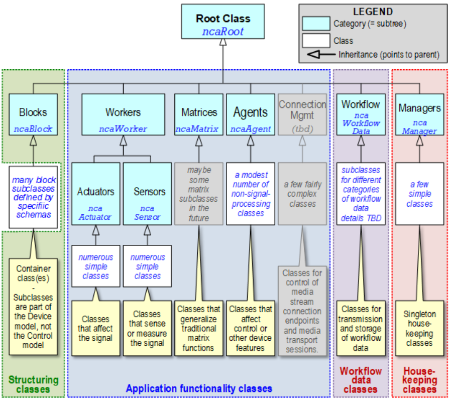

# 7. Control model

## 7.1. Classes

An NCA class is a control abstraction with three elements:

- **Properties**. These are control and status parameters. Each has a datatype and a value. Datatypes may be simple values - boolean, number (various types), text string, bit string, etcetera, or complex structures defined in class definitions. A datatype may be an individual item (scalar), a List of items, or a Map of items.
- **Methods** **.** Methods represent actions a Controller may take on the object. The most common kinds of methods are get(...) and set(...) functions that retrieve and store the values of properties. However, other kinds of methods (e.g. start(...), stop(...)) are defined for some classes.
- **Events**. Events are defined conditions that arise inside objects; Controllers may subscribe to events from an object. For example, all objects include the **PropertyChanged(...)** event, which is raised (i.e. occurs) when the value of a property of the object has changed.

The subscription mechanism is described further in [Events, Notifications and Subscriptions](../110.0._Framework_Mechanisms.html#103-events-notifications-and-subscriptions).

NCA classes are interface-defining classes that imply nothing about the programming classes inside actual products. Some Device developers may elect to use object-oriented programming environments with software class structures that mirror the NCA class tree, while others may take entirely different approaches. Such choices are outside NCA's scope.

Each property, method, and event of a class has a unique identifier. These identifiers (_element identifiers_) are described in the **Identification** section later in this document.

## 7.2. Class inheritance

The NCA control model defines a class inheritance mechanism, in which the various classes' definitions are derived from the definitions of other, more elementary classes, with everything ultimately leading up (if you think of ancestry diagrams) or down (if you think of trees) to a single fundamental base or root named **ncaRoot**. Thus, a control class is the outcome of a **class inheritance hierarchy**.

When a class inherits from another class, _all_ of its properties, methods, and events are inherited. A notable example of this mechanism is the **PropertyChanged(...)** event. **PropertyChanged** is defined in **ncaRoot**. All classes in the model inherit directly or indirectly from **ncaRoot** ; therefore, they all have **PropertyChanged(...)** events. Consequently, a controller can subscribe to property-value changes for any object in the NCA device.

_This document will visualize the class inheritance hierarchy as a tree in inverted form, with ncaRoot at the top, and successive refinements of ncaRoot extending downward. Our tree will be a trailing vine._

### 7.2.1. Class inheritance rules

Over time, the NCA-defined tree of classes will grow. Additionally, product developers will likely extend the public-defined tree with proprietary classes to cover product-specific functions. To cover both of these cases, NCA has expansion rules that ensure the tree expands in a compatible manner, in which new classes, whether arising from NCA growth or proprietary extension, coexist harmoniously with legacy ones.

These rules are:

1. New classes must be defined by inheritance from existing ones.
2. A new ("child") class must implement all the properties, methods, and events of the class ("parent") from which it inherits.
3. A child class may expand its parent's definition by:
  3.1. Defining additional properties, methods, and/or events; and/or
  3.2. Augmenting the definitions of existing properties, methods, and/or events, In this case, the enhanced definitions must support all functions defined by the parent class.
4. A child class's inherited elements must retain the respective element IDs (see [**Identification ~link~**](#_rcilelyelwgb)) from its parent class.

## 7.3. Class hierarchy

For NCA to meet its interoperability objectives, a repertoire of common class definitions must exist. These classes are defined in the NCA control model, via an inheritance hierarchy of control classes that descends from **ncaRoot**.

NCA Control classes are specified in several categories and subcategories. Each category or subcategory has its own base class that inherits directly from **ncaRoot**. All the classes in a category inherit from that category's base class. Thus, each category is a subtree of the overall hierarchy.

`Figure 1` illustrates the NCA class tree, and shows the categories.

|  |
|:--:|
| *Figure 1. NCA Control Model* |

### 7.3.1. Class categories

The categories shown in `Figure 1` are as follows:

- The **Blocks** subtree contains the definition of **ncaBlock** - see [**Blocks ~link~**](#_vdybizkdqrg2).
- The **Workers** subtree contains definitions of classes that have something to do with media signal processing. Here will be found all the familiar audio and video control and monitoring functions.

**Workers** has two subtrees - **Actuators** , which affect signals in various ways, and **Sensors** , which monitor signals.

- The **Matrices** subtree contains the definition of **ncaMatrix** , an optional but useful class in which media signals are constructed by choosing (like in a crosspoint) or combining (like in a mixer) from a set of input signals.
- The **Agents** subtree contains definitions of classes that affect control flow, or that handle specific non-media functions such as power supplies, geolocation sensors, and more.
- Additional broad categories may emerge in future work.

- The **Managers** subtree contains definitions of classes that perform Device housekeeping functions. Each manager class may be instantiated at most once per NCA device. A few of them must be instantiated for NCA conformance - see [**Base Device Schema ~link~**](#_dka4rc8wdnj8).

Two particularly notable Managers are:

1. **ncaDeviceManager**. Contains generic product information (model &amp; serial numbers, for example) and holds overall Device status indicators.
2. **ncaSubscriptionManager**. Manages Controller subscriptions to events.

- The **Workflow Data Classes** subtree contains definitions of classes that contain production workflow information associated with the contents and context of media signals. NCA does not define the format of such data, but provides container services to store and forward it.

## 7.4. Datatype definitions

To support the class definitions, the control model also contains an extensive set of **datatype definitions**. These definitions specify the scalar and structural datatypes used to define class properties and method parameters.
