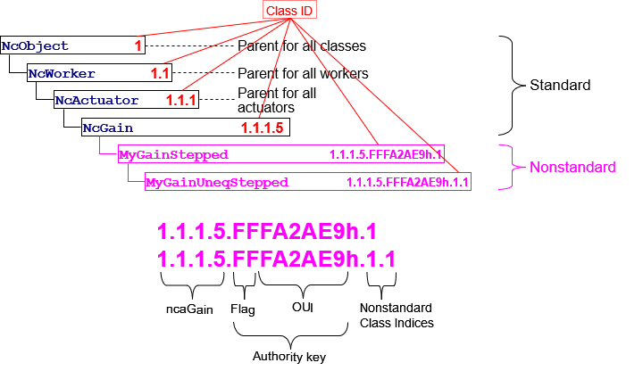

# Appendix A - Class ID Format

## Class IDs

Each class id shall be identified by a hierarchical key nominally of the form i(1)•i(2)•i(3) ... where each i(n) shall be a positive integer that uniquely identifies a class within its siblings at a particular inheritance level of the class tree. Each i(n) is called a _**class index**_.

The lineage key of a class shall be a set of class indices that identifies the entire lineage of the class, beginning from `NcObject`, extending down through all ancestor classes, and ending at the class in question. The key may contain as many class indices as needed to describe the inheritance hierarchy.

To support compatible addition of nonstandard classes to the standard control model, lineage keys allow _**authority keys**_ to be interposed in the sequence of class indices. This feature is described in [Nonstandard classIds](#nonstandard-classids), below.

A class defined by NCA is called a _**standard class**_. The lineage key of a standard class shall contain no authority keys.

An annotated [Example](#example) is given below.

## Class Indices

A class index shall be a positive 32-bit integer.  The value zero is reserved.

For example, for a standard class `NcXXX` whose lineage key is **1•2•12•7** , the lineage key shall be interpreted left-to-right as follows:

• **1** designates `NcObject`.

• **1•2** designates a child of `NcObject`.

• **1•2•12** designates a child of the class whose parent is class **1•2**.

• **1•2•12•7** designates class `NcXXX` , a child of the class whose parent is **1•2•12**.

## Nonstandard classIds

A class not defined by NCA is called a _**nonstandard class**_, and its classId is called a _**nonstandard classId**_. A nonstandard classId shall contain at least one authority key.

Nonstandard classes and their classIds may be created by a manufacturer of a device or by any other organization. The source of a classId is called the class's _**authority**_. An authority key uniquely identifies an authority.

A nonstandard classId shall be constructed by inserting an authority key into the lineage key immediately before the index of the first nonstandard class. In the following details, authority keys will be indicated by "**A**", as in **{i(1)•i(2)•A•i(3) ...}**.

The interpretation of a lineage key that includes an authority key **A** shall be as follows:

1. Every index to the left of **A** shall identify a standard NCA class.
2. Every index to the right of **A** shall identify a nonstandard class defined by the authority identified by **A**.
3. The index immediately to the left of **A** shall identify the class that is the parent of the class whose index is immediately to the right of **A**.

For example, the lineage key **{1•1•2•A•5}** identifies a nonstandard class whose parent is **{1•1•2}** , whose authority is **A** , and whose own (nonstandard) class index is **5**.

All class indices to the right of the authority key shall be considered to be nonstandard. For example, the lineage key **{1•1•2•A•5•4}** identifies a nonstandard class with index **4** that is a child of the nonstandard class with index **5** that is a child of the standard class **{1•1•2}**.

_Note: This rule is a corollary of the rule that a standard class shall not inherit from a proprietary class._

Choice of class ordinal values to the right of an authority key is the responsibility of the identified authority.

## Authority key format

Authority keys use IEEE-registered organization identifiers.

The IEEE (Institute of Electrical and Electronic Engineers) OUI and CID are identifiers that uniquely identify organizations. Any incorporated organization may receive a unique Public CID or OUI from the IEEE upon request and payment of a one-time fee. The difference between the two is that OUIs are used in Ethernet MAC addresses, CIDs are not. The address spaces of the two do not overlap, so they are the same for NCA purposes.

For organizations which own a unique CID or OUI the authority key MUST be a negative 32-bit integer, constructed by prepending FFh onto the 24-bit organization identifier.

For organizations which do not own a unique CID or OUI the authority key MUST be **0**.

## Example

|  |
|:--:|
| **Class IDs:**  Standard and nonstandard forms |
