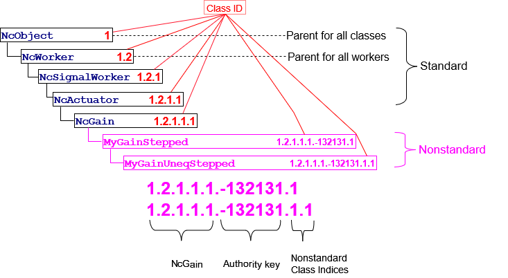

# Appendix A - Class ID Format

## Class IDs

Each class id is identified by using the [NcClassId](https://specs.amwa.tv/ms-05-02/branches/v1.0.x/docs/Framework.html#ncclassid) datatype.

The lineage key of a class is set of class indices that identifies the entire lineage of the class, beginning from [NcObject](https://specs.amwa.tv/ms-05-02/branches/v1.0.x/docs/Framework.html#ncobject), extending down through all ancestor classes, and ending at the class in question. The key contains as many class indices as needed to describe the inheritance hierarchy.

To support compatible addition of non-standard classes to the standard control model, lineage keys allow _**authority keys**_ to be interposed in the sequence of class indices. This feature is described in [Non-standard classIds](#non-standard-classids).

A control class defined by the [Control framework](https://specs.amwa.tv/ms-05-02/) is called a _**standard class**_. The lineage key of a standard class contains no authority keys.

Devices use non-standard classes to model vendor specific functionality in their device models.

An annotated [Example](#example) is given below.

## Class Indices

A class index is a positive 32-bit integer. The value zero is reserved.

For example, for a standard class `NcXXX` whose lineage key is **1•2•12•7** , the lineage key is represented left-to-right as follows:

• **1** designates `NcObject`.

• **1•2** designates a child of `NcObject`.

• **1•2•12** designates a child of the class whose parent is class **1•2**.

• **1•2•12•7** designates class `NcXXX` , a child of the class whose parent is **1•2•12**.

## Non-standard classIds

A class not defined by NCA is called a _**non-standard class**_, and its classId is called a _**non-standard classId**_. A non-standard classId contains at least one authority key.

A non-standard classId is constructed by inserting an authority key into the lineage key immediately before the index of the first non-standard class. In the following examples the authority key is indicated by "**A**".

The interpretation of a lineage key that includes an authority key **A** is as follows:

1. Every index to the left of **A** identifies a standard NCA class.
2. Every index to the right of **A** identifies a non-standard class defined by the authority identified by **A**.
3. The index immediately to the left of **A** identifies the class that is the parent of the class whose index is immediately to the right of **A**.

For example, the lineage key **{1•1•2•A•5}** identifies a non-standard class whose parent is **{1•1•2}** , whose authority is **A** , and whose own (non-standard) class index is **5**.

All class indices to the right of the authority are considered to be non-standard. For example, the lineage key **{1•1•2•A•5•4}** identifies a non-standard class with index **4** that is a child of the non-standard class with index **5** that is a child of the standard class **{1•1•2}**.

Choice of class ordinal values to the right of an authority key is the responsibility of the identified authority.

## Authority key format

Authority keys use IEEE-registered organization identifiers.

The IEEE (Institute of Electrical and Electronic Engineers) OUI and CID are identifiers that uniquely identify organizations. Any incorporated organization can receive a unique Public CID or OUI from the IEEE upon request and payment of a one-time fee. The difference between the two is that OUIs are used in Ethernet MAC addresses, CIDs are not. The address spaces of the two do not overlap, so they are the same for NCA purposes.

## Example

|  |
|:--:|
| **Class IDs:** Standard and non-standard forms |
