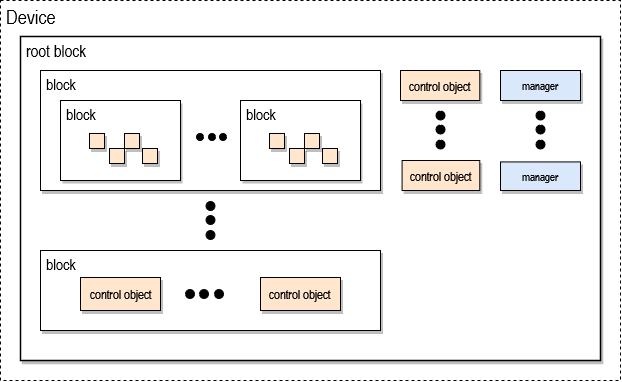
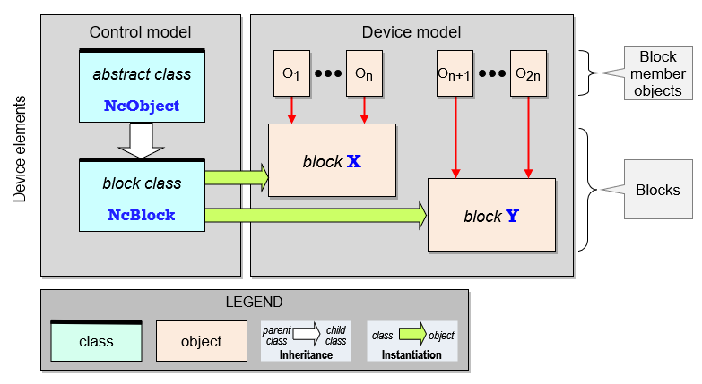

# Device model

An _**NCA Device**_ is a physical or virtual device that publishes an NCA-conformant API. This API is organized around the concept of _**Blocks**_, which are containers for objects. The control model defines a class named [NcBlock](https://specs.amwa.tv/ms-05-02/branches/v1.0-dev/docs/Framework.html#ncblock) that is instantiated to create blocks.

A block can contain other blocks. A contained block is said to be **nested** inside its containing block.

## Device structure

As illustrated in the figure `NCA Device` below, the Device model defines a Device as a [root block](https://specs.amwa.tv/ms-05-02/branches/v1.0-dev/docs/Blocks.html) accompanied by a few control objects. In simple devices, these objects might be contained directly in the root block; in more complex devices, they are contained in a hierarchy of blocks nested inside the root block.

An object contained in a block is called a _**member**_ of that block.

A Device can have certain application functions the designers wish not to be network-controllable. Such functions might not be represented in the root block or its nested blocks, and consequently might not be in the device's control API.

|  |
|:--:|
| _**NCA device**_ |

## Blocks and object roles

Every NCA object has a _role_ that is unique within its containing block (see [Identification](Identification.md)).

Every NCA object is uniquely identified in the device model by its _**role path**_. See [**Identification (Role path)**](Identification.md).

## Control model interaction

The device model is created by instantiating control model classes as shown in the diagram below.

|  |
|:--:|
| _**Device model**_ |

In this case, only two control model classes are shown: [NcObject](https://specs.amwa.tv/ms-05-02/branches/v1.0-dev/docs/Framework.html#ncobject), which is the parent class of all control classes, and [NcBlock](https://specs.amwa.tv/ms-05-02/branches/v1.0-dev/docs/Framework.html#ncblock), which is the base class upon which all block classes are built.

On the right is an example Device model showing blocks **X** and **Y**.
