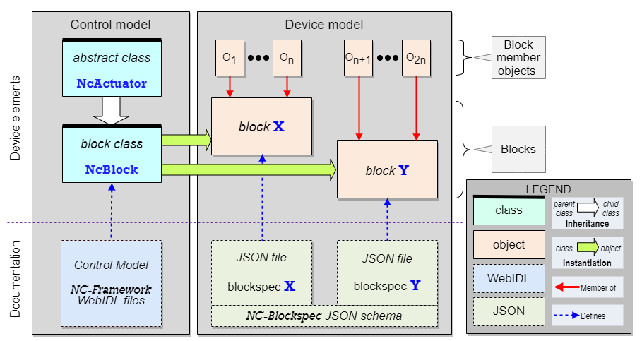
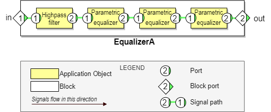
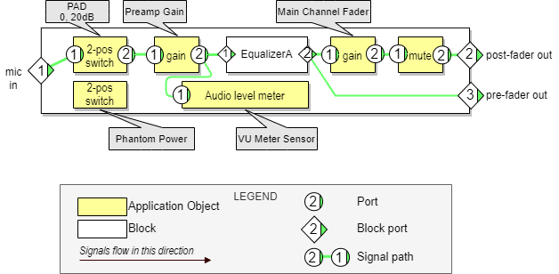

# Device model

An _**NCA Device**_ is a physical or virtual device that publishes an NCA-conformant API. This API is organized around the concept of _**Blocks**_, which are containers for objects. The control model defines a class named [NcBlock](https://specs.amwa.tv/ms-05-02/branches/v1.0-dev/docs/Framework.html#ncblock) that is instantiated to create blocks.

A block can contain other blocks. A contained block is said to be **nested** inside its containing block.

## Device structure

As illustrated in the figure `NCA Device` below, the Device model defines a Device as a [root block](https://specs.amwa.tv/ms-05-02/branches/v1.0-dev/docs/Blocks.html) accompanied by a few control objects. In simple devices, these objects might be contained directly in the root block; in more complex devices, they are contained in a hierarchy of blocks nested inside the root block.

An object contained in a block is called a _**member**_ or _**member object**_ of that block.

A Device can have certain application functions the designers wish not to be network-controllable. Such functions might not be represented in the root block or its nested blocks, and consequently might not be in the device's control API.

|  |
|:--:|
| _**NCA device**_ |

## Blocks and object roles

Every NCA object has a _role_ that is unique within its containing block (see [Identification](Identification.md)).

Every NCA object is uniquely identified in the device model by its _**role path**_. See [**Identification (Role path)**](Identification.md).

## Blockspecs and Blockspec IDs

A _**blockspec**_ is a JSON object that defines the structure of a block. The blockspec format is defined normatively in [MS-05-03 NMOS Control Block Specifications](https://specs.amwa.tv/ms-05-03).

A blockspec is not a block, it is only a way of documenting the contents of NCA blocks.

Within a device, a blockspec can be instantiated any number of times. For example, one might create a blockspec that defines an audio mixer channel, then instantiate it 64 times to define a 64-channel mixer.

Blockspec relationships are illustrated in the figure **Blockspec** below.

|  |
|:--:|
| **Blockspec**:  The **NcBlock** abstract class, a block class, two blocks, and related documents |

On the left of the figure is the control model with its WebIDL fragment. In this case, only two control model classes are shown: [NcObject](https://specs.amwa.tv/ms-05-02/branches/v1.0-dev/docs/Framework.html#ncobject), which is the parent of everything, and [NcBlock](https://specs.amwa.tv/ms-05-02/branches/v1.0-dev/docs/Framework.html#ncblock), which is the abstract base class upon which all block classes are built.

On the right is an example Device model showing blocks **X** and **Y**, the two blockspecs that define them, and the standard JSON schema for all blockspecs.

Blockspecs are identified using ids (see [Identification](Identification.md)).

## Signal paths

A block can expose a set of [signal paths](https://specs.amwa.tv/ms-05-02/branches/v1.0-dev/docs/Blocks.html#ports-and-signal-paths). A signal path is the NCA abstraction that represents a signal flow from one endpoint to another inside a block.

Signal path endpoints are called **NCA ports** or, in context, just **ports**. One or more ports can belong to any object with media signal functionality - processing, monitoring, storing, generating, sending, receiving, etcetera.

Blocks can have ports. A port belonging to a block is called a **block port.** A block port is special in that it can connect to both ports of objects outside the block and ports of objects inside the block. Thus, signals enter and leave blocks via block ports.

The figure **Equalizer** shows the ports and signal paths of a simple multistage audio equalizer block.

|  |
|:--:|
| _**Equalizer**: A simple block, its block ports, its members and their ports, and its signal paths_|

Signal paths cannot cross block boundaries - no signal path can extend from a port inside a given block to a port outside that same block. However, a signal path can extend from a port inside a given block to a block port of that same block, and from there to other block ports.

Ports that send signals are called **output ports**; ports that receive signals are called **input ports**. An output port can connect to multiple downstream input ports, but an input port can connect to at most one upstream output port.

The complete set of signal paths for a block is called the block's **signal flow**.

## Complete block example

A complete block example is shown in the figure **MicPre** below. This example illustrates both block composition and signal flow. The Device shown is a simplified microphone preamplifier. It includes a nested instance of the equalizer block shown in the figure **Equalizer** above.

|  |
|:--:|
| _**MicPre**: Example microphone preamplifier_ |
