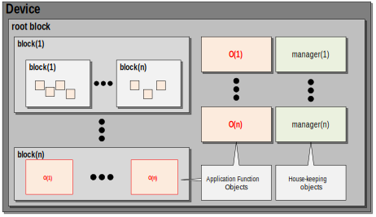
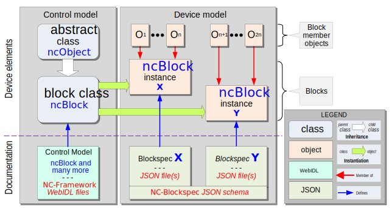
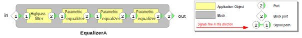
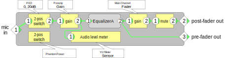

# Device models

An _**NCA Device**_ (or just _**Device**_ in context) is a physical or virtual device that publishes an NCA-conformant API.  A _**Device model**_ is the specification of that API in NCA terms.

## Blocks ##
An NCA API is organized into _**Blocks**_, which are containers for control objects.  A control object is an instance of an NCA control class, and defines a mini-API for a particular control or monitoring function.  Therefore, a block may also be viewed as a container of API elements.  

The NCA Control model defines a class named `ncBlock` that is instantiated to create blocks. 

An object contained in a block is called a _**member**_ or _**member object**_ of that block.  Every block member is an instance of an NCA control class defined by the [NCA Control model](Control%20Model.md) or by a proprietary extension to the Control model.

A block may contain other blocks. A block that is a member of another block is said to be _**nested**_ inside the containing block.

## Root block

As illustrated in the figure [NCA Device](#nca-device) below, a Device model describes a Device as a _**root block**_ that contains all the Device's control objects.   

In simple devices, these objects might be contained directly in the root block.  In more complex devices, they will be contained in a hierarchy of nested blocks inside the root block.

Every Device contains exactly one root block.

The root block contains certain device housekeeping objects  called _**managers.**_  Each manager class may be instantiated at most once per device.  See [Managers](Managers.md).

### Non-controllable device functions

A Device may have certain functions the designers wish not to be network-controllable. Such functions will not have corresponding control object in the root block or its nested blocks, and will consequently not be in the device's control API.

### Hidden control functions

A Device may have certain functions the designers wish to be controllable but not discoverable by casual inspection.  Such functions will have corresponding control objects in the root block, but their existence will not be reported by NCA block [enumeration methods](#block-enumeration). The functions will be a part of the API, but will only be visible to controllers with _a priori_ knowledge of them.

|  |
|:--:|
| _**NCA device**_ |
 
## Blockspecs

A _**blockspec**_ is a JSON object that defines the structure of a block. The blockspec format is explained and normatively defined in [NC&#8209;Blockspecs].  

In general, a blockspec must adhere to the following rules:

- The JSON format must conform to the JSON _**blockspec schema**_ in **NC&#8209;Blockspecs**.

- The blockspec must contain instance declarations of all the block's objects and all its nested blocks.

- The blockspec may specify the block's signal flow, if signal paths are being used - see [Signal paths](#signal-paths).

- Every blockspec must be identified by a **blockspec ID.** When a blockspec is instantiated, its blockspec ID is stored in the `.specID` property of the block object.  

- When a blockspec is intended to be reused, the blockspec ID value must be unique within the intended universe of use.  This unique value is called a Global Spec ID (GSID) value - see [Global blockspec IDs](#global-blockspec-ids), below.

A blockspec is not a block, it is only the description of a block. Blockspecs are the standardized way of documenting the contents of NCA blocks.

A blockspec is a static block definition.  NCA also supports blocks (_dynamic blocks_) whose contents are modifiable at runtime.  See [Device configurability](#device-configurability).

Within a device, a blockspec may be instantiated any number of times.  For example, one might create a blockspec that defines an audio mixer channel, then instantiate it 64 times to define a 64-channel mixer.

Blockspec relationships are illustrated in the figure [Blockspec](#blockspec), below.

|  |
|:--:|
| *Blockspec:  The **ncBlock** class, a block class, two blocks, and related documents* |

On the left is the control model with its WebIDL definition files. In this case, only two control model classes are shown: **ncObject** , which is the parent of everything, and `ncBlock` , which is the abstract base class upon which all block classes are built.

On the right is an example Device model showing blocks **X** and **Y**, the blockspecs that define them, and the standard JSON schema for blockspecs.  

### Blockspec composition

When a block contains nested blocks, its blockspec imports the nested blocks' blockspecs and defines instances of them.

The design process of creating a blockspec by including one or more other blockspecs is called _**blockspec composition**_, the resulting blockspec is called a _**composite blockspec,**_ and the corresponding block is called a _**composite block.**_ 

By retrieving the value of the `.specID` property for each of a composite block's nested blocks - recursing to inner nesting levels as necessary - a Controller can acquire a complete definition of the block's capabilities.

In addition to storing the blockspec ID, `ncBlock` defines methods for retrieving the detailed inventory of contained objects, as further detailed in section [Block enumeration](#block-enumeration).

### Blockspec inheritance

A blockspec may inherit its definition from another blockspec.  This allows developers to construct specific blockspecs from more general ones, and to evolve existing blockspecs upwards-compatibly.

### Blockspecs and APIs

A block's complete API is equal to the union of the APIs of its members, including members of other nested blocks, if any. Therefore, the block's blockspec constitutes a definition of its API.

The API the blockspec defines is a protocol-independent construct, expressed in terms of objects and their properties, methods, and events. Controllers can access it using whatever NCA protocol(s) the Device implements.

## Block namespaces

Every NCA object has a name that is unique _within its containing block_ (see [Identification](Identification.md)) and every block constitutes a namespace for the objects it contains.  

An object's name in its containing block is known as its _**role name**_.

Every NCA object is uniquely identified by its _**role path**_.  See [**Identification(Role path)**](Identification.md).

## Block enumeration

The base `ncBlock` class defines enumeration functions that allow Controllers to interrogate blocks and their sub-blocks directly, to reveal their detailed contents.

The block enumeration functions are regular methods of **ncBlock-** derived classes, accessed in the usual manner through protocol exchanges between Controller and Device. In the case of dynamically-defined devices in which the contents of blocks may vary at runtime, the property-change event can be used to notify controllers about changes to the ncBlock inventory.

## Block configurability

_**Block configurability**_ means the degree to which a block's population and internal signal paths can be defined at run time, as opposed to time of manufacture.

If a block's readonly block property `isDynamic` is `TRUE`, a controller may change the block's membership and/or signal path structure at run time;  if `FALSE`, no such changes are supported.

A block with `isDynamic=TRUE` is called a _**dynamic block.**_  
A block with `isDynamic=FALSE` is called a _**static block.**_

## Signal paths

A block may expose a set of **signal paths**. A signal path is the NCA abstraction that represents a signal flow from one endpoint to another inside a block.

Signal path endpoints are called **NCA ports** or, in context, just **ports**. One or more ports can belong to any object with media signal functionality - processing, monitoring, storing, generating, sending, receiving, etcetera.

Blocks can have ports. A port belonging to a block is called a **block port.** A block port is special in that it can connect to both ports of objects outside the block and ports of objects inside the block. Thus, signals enter and leave blocks via block ports.

The figure [Equalizer](#equalizer) shows the ports and signal paths of a simple multistage audio equalizer block.

|  |
|:--:|
| _**Equalizer: A simple block, its block ports, its members and their ports, and its signal paths**_|

Signal paths cannot cross block boundaries - no signal path may extend from a port inside a given block to a port outside that same block. However, a signal path may extend from a port inside a given block to a block port of that same block, and from there to other block ports, etcetera.

Ports that send signals are called **output ports**; ports that receive signals are called **input ports**. An output port may connect to multiple downstream input ports, but an input port may connect to at most one upstream output port.

The complete set of signal paths for a block is called the block's **signal flow**.

Use of the signal path mechanism is preferred, but not strictly required.

Depending on implementation, a block's signal flow may be read-write or read-only. In a fully-dynamic block, Controllers can retrieve and modify the signal flow. In a static block, Controllers can retrieve the signal flow but not modify it. The `ncBlock` class has methods for retrieving and, if supported, modifying block signal paths.

## Complete block example

A complete block example is shown in the figure [MicPre](#micpre) below. This example illustrates both block composition and signal flow. The Device shown is a simplified microphone preamplifier. It includes a nested instance of the equalizer block shown in the figure [Equalizer](#equalizer) above.

|  |
|:--:|
| _**MicPre: Example microphone preamplifier**_ |

## Blockspec libraries

A prime goal of NCA is to support a growing ecosystem of blockspecs that can be reused by Device developers. NCA (as an architecture) does not define this ecosystem or its management, but it does provide a few features to support it.

It is expected that reusable blockspecs will be maintained in public, corporate, and personal libraries, from which they can be retrieved for various purposes. Such purposes will include:

- Software development of Controllers and Devices;
- In-situ diagnosis of network media system problems;
- Setup of generic, self-configuring Controllers; and
- Training and tutorial processes.

Since blockspecs are JSON documents, the envisioned reusable blockspec ecosystem will be fundamentally concerned with the storage, retrieval, and maintenance of JSON texts.

AMWA's plans and processes for developing, publishing, maintaining, and curating blockspec libraries are beyond the scope of this document.

### Global blockspec IDs

A key NCA feature to support blockspec libraries is the Global blockspec ID, or GSID. In blockspec libraries, a unique GSID value will be assigned to each blockspec intended for reuse. GSIDs will be the principal query key for people or systems seeking to retrieve blockspec definitions from public or corporate libraries, and will be the primary way Controllers retrieve definitions of blockspecs that Devices implement.

The syntax of the GSID is defined in [Identification](Identification.md).

## Minumum compliant Device

NCA defines a blockspec named `NcaBaseDevice` that describes a root block configuration which all Devices must implement to be NCA-compliant. It defines a minimal list of housekeeping objects, but no application function objects.

`NcaBaseDevice` is defined **<< where >>**.
